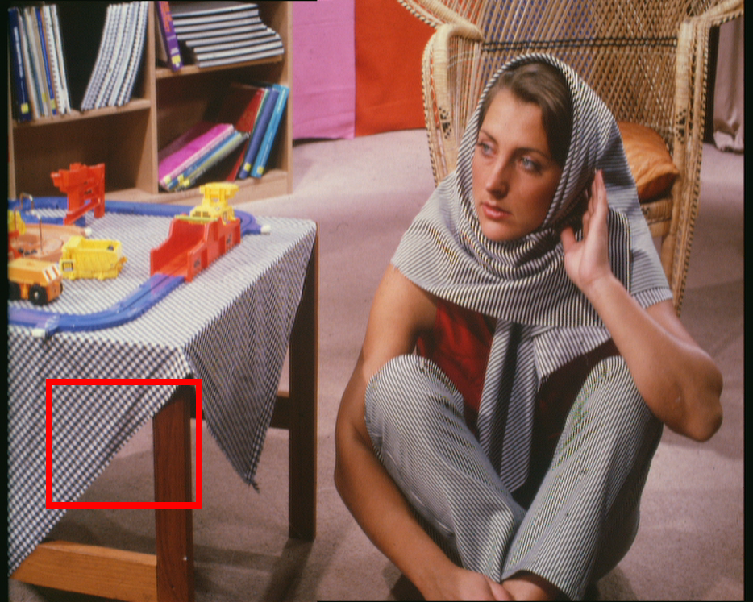
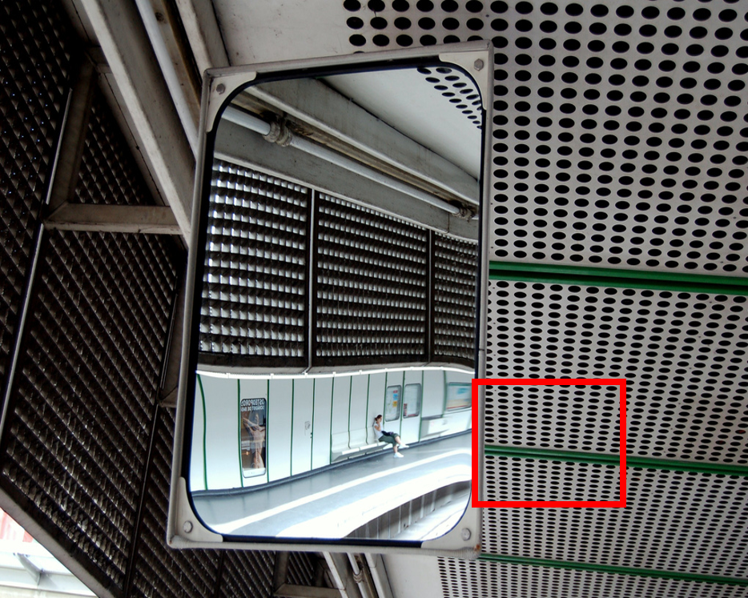
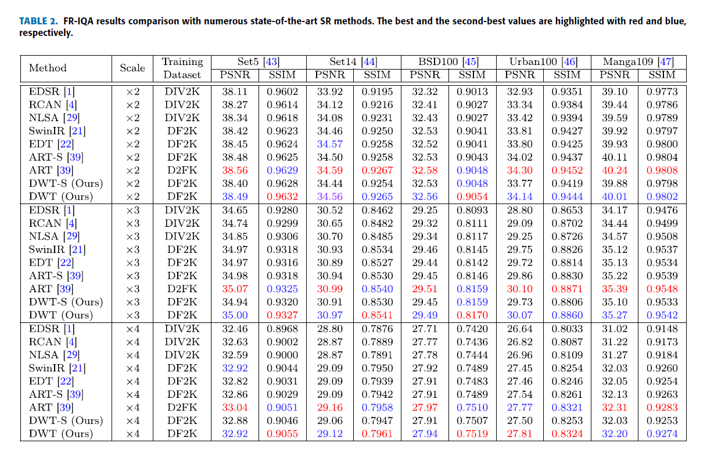
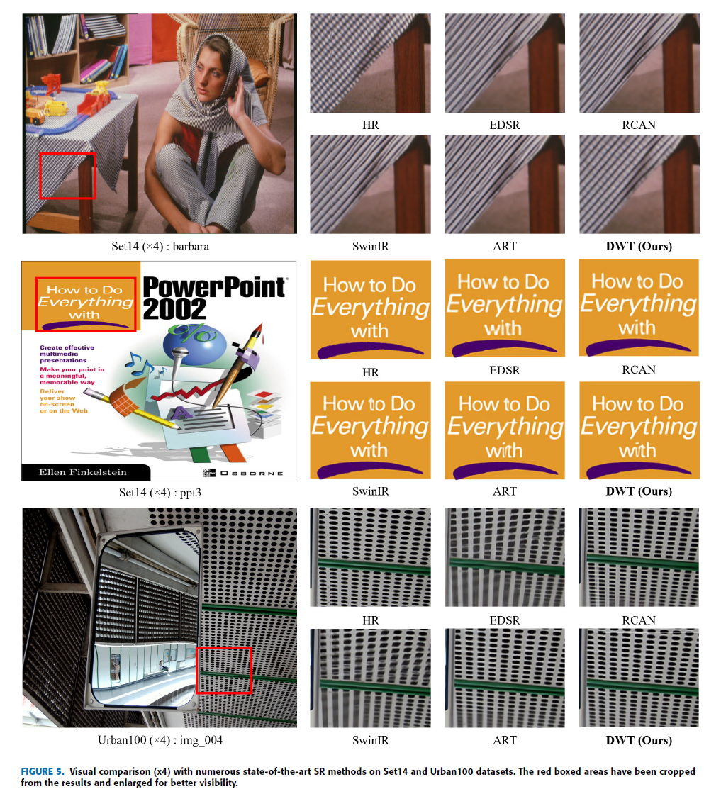
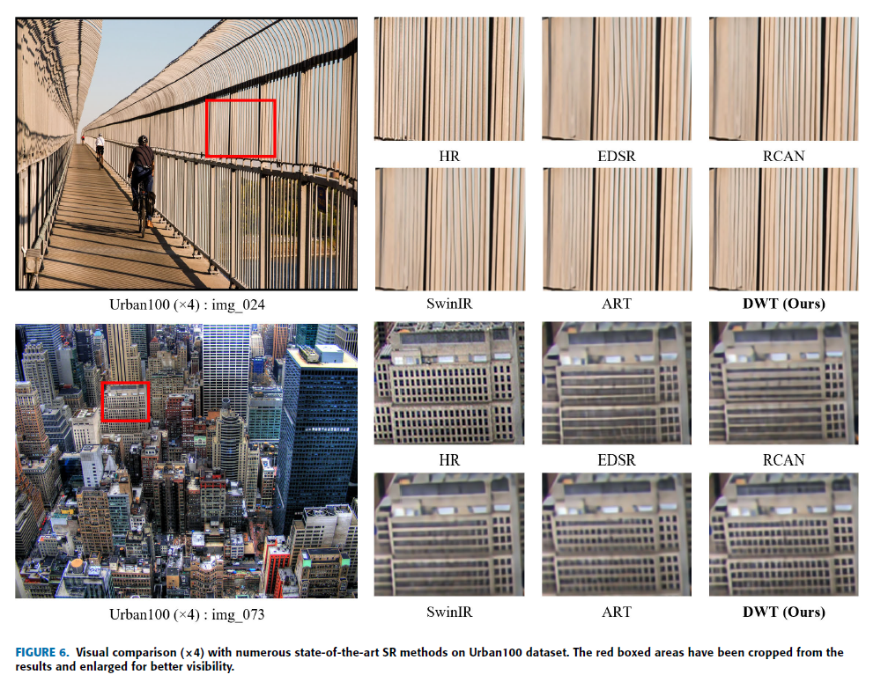

# Image Super-Resolution Using Dilated Window Transformer
This repository is the official PyTorch implementation of **"Image Super-Resolution Using Dilated Window Transformer" (IEEE Access 2023)**.

[[paper]](https://ieeexplore.ieee.org/stamp/stamp.jsp?tp=&arnumber=10147198) [[visual results]](https://drive.google.com/drive/folders/1i5uc7dLGdFrroMwoot4UkrtvSwEEBirP) [[pretrained models]](https://drive.google.com/drive/folders/1GZhT9vhGg0GDgKkTttUzEtmTX-Hsp1L0)

---

> **Abstract :** *Transformer-based networks using attention mechanisms have shown promising results in low-level vision tasks, such as image super-resolution (SR). Specifically, recent studies that utilize windowbased self-attention mechanisms have exhibited notable advancements in image SR. However, windowbased self-attention, results in a slower expansion of the receptive field, thereby restricting the modeling of long-range dependencies. To address this issue, we introduce a novel dilated window transformer, namely DWT, which utilizes a dilation strategy. We employ a simple yet efficient dilation strategy that enlarges the window by inserting intervals between the tokens of each window to enable rapid and effective expansion of the receptive field. In particular, we adjust the interval between the tokens to become wider as the layers go deeper. This strategy enables the extraction of local features by allowing interaction between neighboring tokens in the shallow layers while also facilitating efficient extraction of global features by enabling interaction between not only adjacent tokens but also distant tokens in the deep layers. We conduct extensive experiments on five benchmark datasets to demonstrate the superior performance of our proposed method. Our DWT surpasses the state-of-the-art network of similar sizes by a PSNR margin of 0.11dB to 0.27dB on the Urban100 dataset. Moreover, even when compared to state-of-the-art network with about 1.4 times more parameters, DWT achieves competitive results for both quantitative and visual comparisons.*


<p align="center">

---

|                     SR (x4)                  |                        HQ                                              | [SwinIR](https://github.com/JingyunLiang/SwinIR) |  [ART](https://github.com/gladzhang/ART)      |                  DWT (Ours)                   |
| :------------------------------------------: | :-----------------------------------------------:                     | :----------------------------------------------: | :-------------------------------------------: | :-------------------------------------------: |
| |      | | | |
| |      | | | |

## Requirements
- python 3.8
- pyTorch >= 1.8.0
- NVIDIA GPU + [CUDA](https://developer.nvidia.com/cuda-downloads)

### Installation
```bash
git clone https://github.com/soobin419/DWT.git
cd DWT
pip install -r requirements.txt
python setup.py develop
```

## Datasets

Used training and testing sets can be downloaded as follows:

| Training Set                                                 |                         Testing Set                          |                        Visual Results                        |
| :----------------------------------------------------------- | :----------------------------------------------------------: | :----------------------------------------------------------: |
| [DIV2K](https://data.vision.ee.ethz.ch/cvl/DIV2K/) (800 training images) +  [Flickr2K](https://cv.snu.ac.kr/research/EDSR/Flickr2K.tar) (2650 images) [complete dataset DF2K [download](https://drive.google.com/file/d/1TubDkirxl4qAWelfOnpwaSKoj3KLAIG4/view?usp=share_link)] | Set5 + Set14 + BSD100 + Urban100 + Manga109 [[download](https://drive.google.com/file/d/1n-7pmwjP0isZBK7w3tx2y8CTastlABx1/view?usp=sharing)] | [Google Drive](https://drive.google.com/drive/folders/1i5uc7dLGdFrroMwoot4UkrtvSwEEBirP)|

Download training and testing datasets and put them into the corresponding folders of `datasets/`. See [datasets](datasets/README.md) for the detail of the directory structure.

## Training

- Download [training](https://drive.google.com/file/d/1TubDkirxl4qAWelfOnpwaSKoj3KLAIG4/view?usp=share_link) (DF2K, already processed) and [testing](https://drive.google.com/file/d/1yMbItvFKVaCT93yPWmlP3883XtJ-wSee/view?usp=sharing) (Set5, Set14, BSD100, Urban100, Manga109, already processed) datasets, place them in `datasets/`.

- Run the following scripts. The training configuration is in `options/train/`.

  ```shell
  # DWT-S, input=64x64, 4 GPUs, batch size=8 per GPU
  python -m torch.distributed.launch --nproc_per_node=4 --master_port=2414 basicsr/train.py -opt options/train/train_DWT_S_SRx2_from_scratch.yml --launcher pytorch
  python -m torch.distributed.launch --nproc_per_node=4 --master_port=2414 basicsr/train.py -opt options/train/train_DWT_S_SRx3_finetune_from_SRX2.yml --launcher pytorch
  python -m torch.distributed.launch --nproc_per_node=4 --master_port=2414 basicsr/train.py -opt options/train/train_DWT_S_SRx4_finetune_from_SRX2.yml --launcher pytorch
  
  # DWT, input=64x64, 4 GPUs, batch size=8 per GPU
  python -m torch.distributed.launch --nproc_per_node=4 --master_port=2414 basicsr/train.py -opt options/train/train_DWT_SRx2_from_scratch.yml --launcher pytorch
  python -m torch.distributed.launch --nproc_per_node=4 --master_port=2414 basicsr/train.py -opt options/train/train_DWT_SRx3_finetune_from_SRX2.yml --launcher pytorch
  python -m torch.distributed.launch --nproc_per_node=4 --master_port=2414 basicsr/train.py -opt options/train/train_DWT_SRx4_finetune_from_SRX2.yml --launcher pytorch
  ```

  - The training experiment is in `experiments/`.

## Testing

### Test images with HR

- Download the pre-trained [models](https://drive.google.com/drive/folders/1GZhT9vhGg0GDgKkTttUzEtmTX-Hsp1L0) and place them in `experiments/pretrained_models/`.

  We provide pre-trained models for image SR: DWT-S, DWT (x2, x3, x4).

- Download [testing](https://drive.google.com/file/d/1yMbItvFKVaCT93yPWmlP3883XtJ-wSee/view?usp=sharing) (Set5, Set14, BSD100, Urban100, Manga109) datasets, place them in `datasets/`.

- Run the following scripts. The testing configuration is in `options/test/` (e.g., [test_DWT_x2.yml](options/test/test_DWT_SRx2_from_scratch.yml)).


  ```shell
  # DWT-S, reproduces results in Table 2 of the main paper
  python basicsr/test.py -opt options/test/test_DWT_S_SRx2_from_scratch.yml
  python basicsr/test.py -opt options/test/test_DWT_S_SRx3_finetune_from_SRX2.yml
  python basicsr/test.py -opt options/test/test_DWT_S_SRx4_finetune_from_SRX2.yml
  
  # DWT, reproduces results in Table 2 of the main paper
  python basicsr/test.py -opt options/test/test_DWT_SRx2_from_scratch.yml
  python basicsr/test.py -opt options/test/test_DWT_SRx3_finetune_from_SRX2.yml
  python basicsr/test.py -opt options/test/test_DWT_SRx4_finetune_from_SRX2.yml
  ```

- The output is in `results/`.

### Test images without HR

- Download the pre-trained [models](https://drive.google.com/drive/folders/1GZhT9vhGg0GDgKkTttUzEtmTX-Hsp1L0) and place them in `experiments/pretrained_models/`.

  We provide pre-trained models for image SR: DWT-S, DWT (x2, x3, x4).

- Put your dataset (single LR images) in `datasets/single`. Some test images are in this folder.

- Run the following scripts. The testing configuration is in `options/test/` (e.g., [test_single_x2.yml](options/test/test_DWT_single_x2.yml)).

    Note 1: The default model is DWT. You can use other models like DWT-S by modifying the YML.

  ```shell
  # Test on your dataset
  python basicsr/test.py -opt options/test/test_DWT_single_x2.yml
  python basicsr/test.py -opt options/test/test_DWT_single_x3.yml
  python basicsr/test.py -opt options/test/test_DWT_single_x4.yml
  ```

- The output is in `results/`.

## Results

We achieved state-of-the-art performance. Detailed results can be found in the paper. All visual results of DWT can be downloaded [here](https://drive.google.com/drive/folders/1i5uc7dLGdFrroMwoot4UkrtvSwEEBirP).

<details>
<summary>Click to expan</summary>

- results in Table 2 of the main paper

<p align="center">
  
</p>

- visual comparison (x4) in the main paper

<p align="center">
  
  
</p>

## Citation

If you find the code helpful in your research or work, please cite the following paper(s).

```
@ARTICLE{10147198,
  author={Park, Soobin and Choi, Yong Suk},
  journal={IEEE Access}, 
  title={Image Super-Resolution Using Dilated Window Transformer}, 
  year={2023},
  volume={11},
  number={},
  pages={60028-60039},
  doi={10.1109/ACCESS.2023.3284539}}
```

## Acknowledgements

This code is built on  [BasicSR](https://github.com/XPixelGroup/BasicSR).
    
